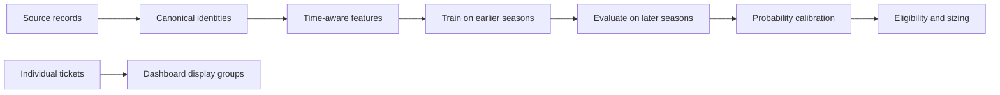

# Bjellac — College Football Analytics

[](https://github.com/smarkos22/Bjellac-Analytics/actions/workflows/ci.yml)

**Data reconciliation, time-aware features, statistical modeling, and dashboard
contracts from a college football analytics application.**

Different sources describe the same teams and games differently. Historical
statistics can also include information that was unavailable at prediction time.
Bjellac addresses these problems with explicit identity resolution, prior-game
feature construction, season-based evaluation, and checks at the display boundary.

This repository is a curated source selection from a larger working project.
It includes runnable offline examples and regression tests. The full application
also includes ingestion, a Flask dashboard, market monitoring, public-text
research, and film analysis; those services are outside this snapshot.

## Start here

| Engineering problem | Implementation |
|---|---|
| Resolve inconsistent team names without silently guessing | [Team registry](bjellac/canonical/team_resolver.py): exact normalized matches, explicit aliases, scoped resolution, and an unresolved-review queue |
| Construct inputs appropriate to each game | [Feature builders](bjellac/strategies/strategy_01_lgbm_totals/features/): ratings, prior-game statistics, context, weather, and research features |
| Evaluate on later seasons | [Walk-forward training](bjellac/strategies/strategy_01_lgbm_totals/models/train.py): earlier-season training and per-season model/market errors |
| Turn raw probabilities into usable estimates | [Calibration](bjellac/strategies/strategy_01_lgbm_totals/calibration.py): isotonic fit/transform and bounded outputs |
| Exclude teams without the required historical coverage | [Eligibility gate](bjellac/strategies/strategy_01_lgbm_totals/eligibility.py): checks both home and away teams |
| Combine matching tickets without changing the underlying records | [Dashboard grouping](dashboard/static/js/slip_groups.js): contract identity, stake totals, and weighted prices |

## Architecture



The code assumes DuckDB canonical tables and uses Polars for transformations.
Provider data and trained artifacts are excluded. The included examples construct
their own toy inputs; they do not train or reproduce the operational model.

## Run locally

The smallest entry point needs only Node.js 22:

```bash
node --test tests/test_slip_groups.cjs
```

For the Python example and tests, use Python 3.12:

```bash
python3.12 -m venv .venv
source .venv/bin/activate
python -m pip install -r requirements.txt
python examples/offline_demo.py
python -m pytest -q
```

The example shows an exact team match, an ambiguous mascot that is left
unresolved, and a match resolved using an explicit candidate set. It also
exercises calibration and capped sizing on invented inputs. It requires no
credentials, database, or network calls after dependency installation.

CI runs these checks on Linux. Tests cover alias persistence, ambiguity handling,
home/away eligibility, calibration properties, and ticket grouping. The test
suite is a selected set of contracts, not a validation of every included module.

## Research boundaries

Season separation is necessary but does not by itself establish that every
source value was available at the time of a prediction. Source timestamps,
revisions, and feature construction need their own audits. Calibration requires
data separate from final evaluation; the tiny demo dataset establishes no
accuracy claim. Position sizing is only as useful as the probability estimates
that feed it.

This source snapshot makes no profitability claim. Research parameters and
feature families should be evaluated with explicit baselines, held-out data,
and controls for repeated experimentation.

## Project context

I built and operate the broader project with AI coding assistance. My work
includes defining the workflow, choosing data and evaluation rules, reviewing
outputs, and investigating failures. This repository makes the implementation
and its limitations inspectable.

See [source selection and adaptations](docs/SOURCE_SELECTION.md) for the public
snapshot boundary. Related project: [PGA golf analytics](https://github.com/smarkos22/PGA-Analytics).

Publication controls and review limits are described in [the publication policy](docs/PUBLICATION_POLICY.md).
